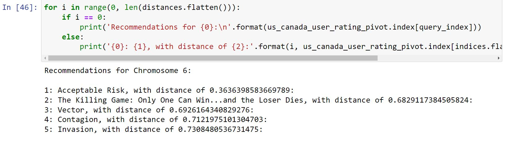
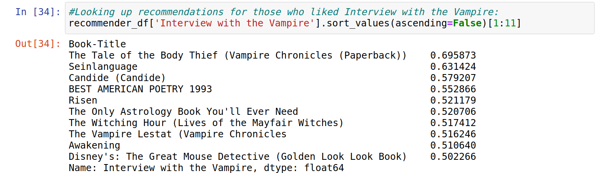

# Book-Recommendation-System
A book recommendation is a system which recommends books based on users similarity(also known as collaborative filtering) and content based similarity.used K nearest neighbour to calculate similarity among different users.

# ScreenShots
Recommendation Based on user similarity(collaborative based)

Recommendation based on content similarity(content based)

# Conclusion
Recommender systems are a powerful new technology for extracting additional value for a business from its user databases. Recommender systems benefit users by enabling them to find items they like. Conversely, they help the business by generating more sales.
